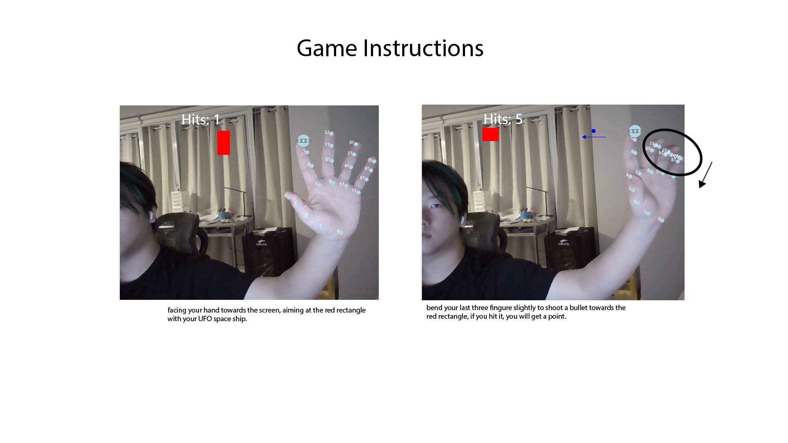

# HW09
I choose the hand pose form ml5
https://learn.ml5js.org/#/reference/handpose

I am currently taking an Augmented Reality course, so I'm very interested in creating a gesture-controlled game. After some research, I learned that a viable method is to record and compare the positions of various points on the fingers to determine gestures. Initially, I wanted to create a game where making a gun gesture would shoot little balls, but I found that since the thumb has a wide range of motion and it's short, it's difficult to judge distances and often fails to receive commands correctly. So, I ended up using the ring finger to control gesture changes (as the last three fingers almost move together). A ball is shot when the tip of the ring finger is lower than the knuckle. Players can hit targets with the ball to score points.

I think using someone else's code is an exciting process, but it also brings challenges and difficulties. For instance, I spent quite some time understanding how exactly to listen for position information of specific points, and so on...

Image on repo:  

